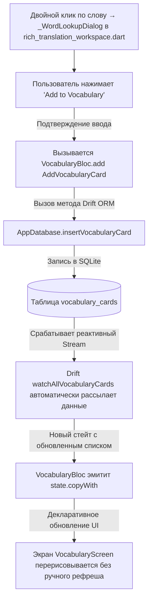

# 📘 Технический мануал LangVor: Руководство по архитектуре и разработке

Добро пожаловать в личную настольную книгу разработчика проекта **LangVor**! Этот документ составлен Главным Архитектором, чтобы помочь вам полностью взять управление проектом в свои руки, уверенно расширять его функционал и не ломать архитектурные связи.

---

## 🗺 1. Генеральная карта проекта

Проект **LangVor** разработан на фреймворке **Flutter (Dart)** и представляет собой кроссплатформенное (Windows/macOS) приложение для практики перевода с русского языка на английский (уровни A2-B1 → B2) с локальной базой данных, офлайн-инструментами лингвистического анализа (NLP) и онлайн-проверкой перевода через MyMemory Translation API (бесплатный, без ключа).

### 📂 Интерактивное дерево проекта и назначение папок

Ниже представлена полная структура репозитория с описанием назначения каждого уровня:

```text
LangVor/
├── .dart_tool/                  # [КРАСНАЯ ЗОНА] Служебные файлы сборки Dart/Flutter (автогенерация)
├── assets/                      # Статические ресурсы приложения
│   ├── dictionary/
│   │   ├── en_ru_50k.json       # Демо-набор En-Ru пар (333 слова) — используется для офлайн-фолбэка
│   │   │                        # сопоставления перевода и попап-поиска слов, НЕ для проверки орфографии
│   │   ├── en_words.txt         # Монолингвальный английский словарь (~830k словоформ) для SpellChecker
│   │   └── en_words.LICENSE.txt # Происхождение и лицензия en_words.txt (public domain)
│   └── grammar/
│       └── grammar_rules.json   # JSON-база правил грамматики для офлайн-проверок
├── lib/                         # Исходный код приложения (Clean Architecture-like)
│   ├── data/                    # Слой данных (Database, ORM, модели)
│   │   ├── database.dart        # Описание таблиц Drift/SQLite и методов запросов
│   │   └── database.g.dart      # [КРАСНАЯ ЗОНА] Автогенерируемый Drift-код
│   ├── domain/                  # Слой бизнес-логики и чистого лингвистического анализа
│   │   ├── nlp/                 # Модули NLP (Natural Language Processing), не зависят от сети
│   │   │   ├── english_wordlist.dart    # In-memory английский словарь для SpellChecker
│   │   │   ├── levenshtein.dart         # Расстояние Левенштейна (общая утилита)
│   │   │   ├── grammar_checker.dart     # Офлайн-проверка грамматики (регулярки + эвристика)
│   │   │   ├── spell_checker.dart       # Орфографический анализатор (EnglishWordlist + Левенштейн)
│   │   │   ├── tokenizer.dart           # Разбиение предложений на токены с сохранением смещений (offsets)
│   │   │   └── translation_matcher.dart # Офлайн-фолбэк: сопоставление по локальному En-Ru словарю
│   │   ├── online/               # Онлайн-проверка перевода через MyMemory Translation API
│   │   │   ├── mymemory_client.dart          # HTTP-клиент MyMemory (сегментация, обработка квоты/ошибок)
│   │   │   ├── translation_cache.dart        # Кэш эталонных переводов (SharedPreferences, по абзацу)
│   │   │   └── online_translation_checker.dart # Сравнение перевода пользователя с эталоном MyMemory
│   │   ├── dictionary_seeder.dart  # Первичный импорт JSON-словаря En-Ru и грамматических правил в SQLite
│   │   ├── offline_analyzer.dart   # Быстрый локальный слой: токенизация + орфография + грамматика + фолбэк
│   │   └── srs_engine.dart         # Алгоритм интервальных повторений SM-2 (SuperMemo) для карточек
│   ├── presentation/            # Слой представления (UI и управление состоянием)
│   │   ├── bloc/                # Логика управления состоянием (flutter_bloc)
│   │   │   ├── settings/
│   │   │   │   └── settings_bloc.dart    # Тема, размер шрифта, флаг онлайн-проверки, контактный email
│   │   │   ├── translation/
│   │   │   │   └── translation_bloc.dart # Редактор переводов: автосохранение, офлайн- и онлайн-анализ
│   │   │   └── vocabulary/
│   │   │       └── vocabulary_bloc.dart  # Состояние карточек (интервальное повторение, поиск, импорт/экспорт)
│   │   ├── screens/             # Экраны (Страницы) приложения
│   │   │   ├── rich_translation_workspace.dart # Главный редактор (Quill side-by-side)
│   │   │   ├── settings_screen.dart            # Экран настроек приложения
│   │   │   └── vocabulary_screen.dart          # Экран интервального повторения и словаря
│   │   ├── theme/               # Стили и темы оформления
│   │   │   ├── app_colors.dart         # Цветовая палитра (светлая/тёмная)
│   │   │   ├── app_spacing.dart        # Общая шкала отступов/радиусов
│   │   │   └── app_theme.dart          # Конфигурация ThemeData для Flutter
│   │   ├── widgets/             # Общие переиспользуемые UI-компоненты
│   │   │   ├── app_card.dart               # Общая карточка/секция/тайл (AppCard, AppCardTile)
│   │   │   ├── state_placeholders.dart     # Общие пустое/загрузка/ошибка состояния
│   │   │   ├── error_tooltip.dart          # Тултип с деталями ошибки и кнопкой "применить"
│   │   │   ├── flip_flash_card.dart        # Анимированная карточка для SRS-повторений
│   │   │   ├── formatting_toolbar.dart     # Панель форматирования Quill-текста
│   │   │   ├── keyboard_shortcuts_wrapper.dart # Обработчик горячих клавиш (Ctrl/Cmd+Enter/N, Escape)
│   │   │   └── new_project_dialog.dart     # Диалог создания нового перевода
│   │   ├── app.dart             # Навигационный каркас (Shell) + горячие клавиши + синхронизация настроек
│   │   └── main.dart            # Точка входа, инициализация SQLite, загрузка словаря, DI-провайдеры BLoC
│   ├── tools/                   # Инструменты разработчика
│   │   └── generate_dictionary.dart # Скрипт генерации En-Ru JSON-словаря из сырых Dart-данных
│   └── utils/                   # Хелперы и утилиты
│       ├── constants.dart       # Глобальные константы
│       └── text_splitter.dart   # Логика разбивки текста на предложения
├── test/                        # Юнит- и виджет-тесты
├── .github/workflows/           # CI (analyze+test) и Release (сборка Windows/macOS, публикация)
├── pubspec.yaml                 # Конфигурация зависимостей Flutter и путей к assets
└── pubspec.lock                 # Зафиксированные версии пакетов
```

### 🧩 Архитектурное разделение слоев

Хотя проект является монолитным клиентским мобильным/десктопным приложением, его внутренняя архитектура четко разграничивает роли:

| Компонент | Где находится в коде | Используемые технологии / библиотеки |
| :--- | :--- | :--- |
| **Фронтенд (UI)** | [lib/presentation](file:///Users/roman/Downloads/Telegram%20Desktop/LangVor/lib/presentation) | Flutter Widgets, `flutter_quill` (редактор rich-text), `flutter_animate` (анимации), Google Fonts |
| **Управление состоянием** | [lib/presentation/bloc](file:///Users/roman/Downloads/Telegram%20Desktop/LangVor/lib/presentation/bloc) | `flutter_bloc` (BLoC паттерн для отделения логики от UI), `equatable` (сравнение состояний) |
| **База данных** | [lib/data/database.dart](file:///Users/roman/Downloads/Telegram%20Desktop/LangVor/lib/data/database.dart) | `drift` (реактивная ORM поверх SQLite), `sqlite3_flutter_libs` |
| **Бэкенд-логика (NLP & SRS)** | [lib/domain](file:///Users/roman/Downloads/Telegram%20Desktop/LangVor/lib/domain) | Кастомные Dart-классы для лексического разбора, сопоставления переводов и алгоритма SM-2 |
| **Конфигурации** | Корень проекта | `pubspec.yaml`, `analysis_options.yaml` (правила линтера) |

---

## 🚦 2. Карта безопасности: куда лезть, а куда нет

Для предотвращения фатальных ошибок и неработоспособности кода, проект разделен на две зоны доступа.

### 🟥 Раздел «КРАСНАЯ ЗОНА» (Только через генераторы и спец-процедуры)

> [!WARNING]
> Прямое редактирование этих файлов вручную приведет к потере работоспособности проекта, рассинхронизации схемы данных или затиранию ваших изменений при следующей сборке.

1. **`lib/data/database.g.dart`**
   * **Почему нельзя трогать:** Это автогенерируемый файл Drift. Он содержит сгенерированные SQL-запросы, мапперы строк и внутренний класс `_$AppDatabase`.
   * **Как работать:** Опишите изменения в таблицах внутри [database.dart](file:///Users/roman/Downloads/Telegram%20Desktop/LangVor/lib/data/database.dart), затем запустите генератор кода в терминале (см. раздел 4).
2. **`onUpgrade` метод в [lib/data/database.dart](file:///Users/roman/Downloads/Telegram%20Desktop/LangVor/lib/data/database.dart#L94-L121)**
   * **Почему нельзя трогать просто так:** При некорректном написании миграции SQLite, приложение у существующих пользователей начнет вылетать (crash) на старте из-за несовпадения версий схемы БД.
   * **Как работать:** Каждое изменение структуры таблиц требует инкремента `schemaVersion` и добавления явной команды миграции (например, `await m.addColumn(...)`).
3. **`assets/dictionary/en_ru_50k.json` и `assets/grammar/grammar_rules.json`**
   * **Почему нельзя трогать вручную:** Любая синтаксическая ошибка (лишняя запятая, неэкранированная кавычка) сломает JSON-парсер на старте, и словарь/правила не импортируются в базу данных.
   * **Как работать:** Для обновления словаря используйте генератор [lib/tools/generate_dictionary.dart](file:///Users/roman/Downloads/Telegram%20Desktop/LangVor/lib/tools/generate_dictionary.dart).

---

### 🟩 Раздел «ЗЕЛЕНАЯ ЗОНА» (Свободное редактирование)

> [!TIP]
> Здесь вы можете писать код самостоятельно, проводить эксперименты и менять логику работы без риска повредить системные механизмы сборки.

1. **Интерфейс экранов и виджетов:**
   * Смело меняйте верстку, цвета и отступы в папках [screens/](file:///Users/roman/Downloads/Telegram%20Desktop/LangVor/lib/presentation/screens) и [widgets/](file:///Users/roman/Downloads/Telegram%20Desktop/LangVor/lib/presentation/widgets).
2. **Цветовая палитра и темы:**
   * Файлы [app_colors.dart](file:///Users/roman/Downloads/Telegram%20Desktop/LangVor/lib/presentation/theme/app_colors.dart) и [app_theme.dart](file:///Users/roman/Downloads/Telegram%20Desktop/LangVor/lib/presentation/theme/app_theme.dart) созданы специально для кастомизации визуального стиля (шрифты, радиусы скругления, тёмная тема).
3. **Правила грамматики (эвристика):**
   * В файле [grammar_checker.dart](file:///Users/roman/Downloads/Telegram%20Desktop/LangVor/lib/domain/nlp/grammar_checker.dart) вы можете добавлять новые методы эвристических проверок (аналогично проверке артиклей `_checkArticleUsage` или двойных отрицаний `_checkDoubleNegatives`).
4. **Управление состоянием (BLoC):**
   * Расширяйте перечни событий (Events) и состояний (States) в BLoC-файлах для внедрения нового функционала.

---

## 🔄 3. Потоки данных (Data Flow)

Для наглядного понимания того, как взаимодействуют слои приложения, разберем два ключевых процесса.

### Процесс А: Ввод текста пользователем → Офлайн-анализ → Онлайн-проверка → Подсветка ошибок

Локальный анализ (орфография + грамматика + офлайн-фолбэк сопоставления) всегда быстрый и синхронный — печать никогда не блокируется. Онлайн-проверка через MyMemory запускается отдельным событием следом и обновляет результат, когда (и если) ответ придёт.

```mermaid
sequenceDiagram
    autonumber
    actor User as Пользователь
    participant UI as rich_translation_workspace.dart
    participant BLoC as translation_bloc.dart
    participant Analyzer as offline_analyzer.dart
    participant Online as OnlineTranslationChecker
    participant MyMemory as MyMemory API

    User->>UI: Вводит текст перевода в QuillEditor
    UI->>BLoC: Добавляет событие UpdateTranslationText(text, delta)
    Note over BLoC: Таймер автосохранения (500ms)<br/>Дебаунс автоанализа (800ms)
    BLoC->>BLoC: Автосохранение текста в фоновом режиме

    rect rgb(240, 248, 255)
        Note over Analyzer: Быстрый локальный слой (Tokenizer → SpellChecker → GrammarChecker → TranslationMatcher-фолбэк)
        BLoC->>Analyzer: analyze(sourceText, translationText)
        Analyzer-->>BLoC: AnalysisResult (checkSource=offlineFallback)
        BLoC->>UI: Эмитит state с результатом — UI обновляется сразу
    end

    rect rgb(240, 255, 245)
        Note over Online: Если включена онлайн-проверка (Settings)
        BLoC->>Online: check(sourceRussian, userEnglish)
        Online->>Online: Проверяет кэш по абзацу (TranslationCache)
        alt нет в кэше
            Online->>MyMemory: GET /get?q=...&langpair=ru|en
            MyMemory-->>Online: reference translation
            Online->>Online: Сохраняет в кэш
        end
        Online->>Online: Сравнивает контент-слова эталона с текстом пользователя
        Online-->>BLoC: OnlineCheckResult (similarity, missing words, reference)
        BLoC->>UI: Эмитит обновлённый AnalysisResult (checkSource=online/cache)
    end

    UI->>UI: _ErrorIndicatorColumn + _OnlineStatusChip перерисовываются
    Note over UI: Ошибки — цветные иконки по severity; статус-чип показывает источник проверки
```

Если MyMemory недоступен, превышена квота или онлайн-проверка выключена в настройках — `OnlineTranslationChecker` возвращает `checkSource=offlineFallback` вместо исключения, и UI просто остаётся на результате локального анализа.

---

### Процесс Б: Добавление карточки в словарь и авто-обновление списков



---

## 🛠 4. Инструкция по самостоятельной разработке

### 📝 Пошаговый чек-лист: «Как добавить новое поле в сущность карточки (например, уровень CEFR)»

Давайте разберем процесс добавления поля `cefrLevel` в карточки интервального повторения (`VocabularyCards`), чтобы вы могли проделать это самостоятельно.

#### Шаг 1: Добавление столбца в описание таблицы
Откройте файл [lib/data/database.dart](file:///Users/roman/Downloads/Telegram%20Desktop/LangVor/lib/data/database.dart#L27-L42). В класс `VocabularyCards` добавьте новое поле:
```dart
class VocabularyCards extends Table {
  IntColumn get id => integer().autoIncrement()();
  TextColumn get englishWord => text()();
  TextColumn get russianTranslation => text()();
  // ... существующие столбцы ...
  
  // НОВОЕ ПОЛЕ:
  TextColumn get cefrLevel => text().withDefault(const Constant(''))();
}
```

#### Шаг 2: Увеличение версии схемы БД и регистрация миграции
Там же в [lib/data/database.dart](file:///Users/roman/Downloads/Telegram%20Desktop/LangVor/lib/data/database.dart#L91-L121) найдите геттер `schemaVersion` и увеличьте его на 1:
```dart
@override
int get schemaVersion => 3; // Было 2
```
В метод `onUpgrade` добавьте логику добавления новой колонки:
```dart
onUpgrade: (m, from, to) async {
  if (from < 2) {
    // старые миграции ...
  }
  if (from < 3) {
    // Добавляем новую колонку cefrLevel в существующую таблицу vocabularyCards
    await m.addColumn(vocabularyCards, vocabularyCards.cefrLevel);
  }
},
```

#### Шаг 3: Запуск кодогенератора build_runner
Откройте терминал в корне проекта и выполните команду для пересборки генерируемых файлов:
```bash
dart run build_runner build --delete-conflicting-outputs
```
*Эта команда удалит старый `database.g.dart` и сгенерирует новый класс `VocabularyCard` с поддержкой поля `cefrLevel`.*

#### Шаг 4: Обновление BLoC (Слой бизнес-логики)
Откройте [lib/presentation/bloc/vocabulary/vocabulary_bloc.dart](file:///Users/roman/Downloads/Telegram%20Desktop/LangVor/lib/presentation/bloc/vocabulary/vocabulary_bloc.dart#L23-L41).
1. Обновите событие `AddVocabularyCard`, добавив параметр `cefrLevel`:
   ```dart
   class AddVocabularyCard extends VocabularyEvent {
     final String englishWord;
     final String russianTranslation;
     final String definition;
     final String contextSentence;
     final String partOfSpeech;
     final String cefrLevel; // Новое поле

     const AddVocabularyCard({
       required this.englishWord,
       required this.russianTranslation,
       this.definition = '',
       this.contextSentence = '',
       this.partOfSpeech = '',
       this.cefrLevel = '', // Новое поле по умолчанию пустым
     });
     // Не забудьте добавить в props!
   }
   ```
2. Обновите обработчик события в `VocabularyBloc` (метод записи в базу):
   ```dart
   // Ищите вызов insertVocabularyCard в блоке
   await _db.insertVocabularyCard(
     VocabularyCardsCompanion.insert(
       englishWord: event.englishWord,
       russianTranslation: event.russianTranslation,
       definition: Value(event.definition),
       contextSentence: Value(event.contextSentence),
       partOfSpeech: Value(event.partOfSpeech),
       cefrLevel: Value(event.cefrLevel), // Записываем в БД
     ),
   );
   ```

#### Шаг 5: Обновление UI-компонентов
1. В файле [lib/presentation/screens/rich_translation_workspace.dart](file:///Users/roman/Downloads/Telegram%20Desktop/LangVor/lib/presentation/screens/rich_translation_workspace.dart) найдите приватный виджет `_WordLookupDialog` (диалог добавления слова в словарь) и добавьте поле ввода (Dropdown или TextField) для выбора уровня CEFR (A1, A2, B1, B2, C1, C2).
2. Передавайте значение этого поля при отправке события добавления карточки.
3. На экране [lib/presentation/screens/vocabulary_screen.dart](file:///Users/roman/Downloads/Telegram%20Desktop/LangVor/lib/presentation/screens/vocabulary_screen.dart) в верстке карточки выведите бейдж с уровнем CEFR:
   ```dart
   Text(card.cefrLevel, style: TextStyle(fontWeight: FontWeight.bold))
   ```

---

### 🔍 Как читать ошибки в консоли разработки

Если после внесения изменений что-то сломалось, без паники! Вот шпаргалка по типичным ошибкам вашего стека:

#### 1. Ошибки компиляции Dart (Syntax / Compile Errors)
* **Как выглядит:**
  ```text
  lib/presentation/screens/vocabulary_screen.dart:125:45: Error: The parameter 'card' isn't defined.
  ```
* **Как читать:** Первая цифра (`125`) — строка в файле, вторая (`45`) — символ. Компилятор прямо указывает, что переменной `card` не существует в данной области видимости.
* **Что делать:** Перейдите по ссылке на файл в IDE и проверьте орфографию имен переменных, наличие импорта или правильность объявления параметров.

#### 2. Ошибки Drift и SQLite (Database Errors)
* **Как выглядит:**
  ```text
  SqliteException(1): no such column: vocabulary_cards.cefr_level, while compiling...
  ```
* **Как читать:** SQLite сообщает, что вы пытаетесь прочитать или записать поле `cefr_level`, которого физически нет в таблице базы данных на диске.
* **Что делать:**
  1. Вы забыли увеличить `schemaVersion` или написать миграцию в `onUpgrade`.
  2. Вы написали миграцию, но на вашем симуляторе/устройстве запущена старая БД. Удалите приложение с симулятора полностью и запустите заново — база пересоздастся с чистого листа.

#### 3. Неконсистентность состояний BLoC (State Bugs)
* **Как выглядит:** Вы нажали кнопку, событие ушло, но на экране ничего не поменялось.
* **Что делать:**
  1. Проверьте, добавлен ли ваш новый стейт/событие в `props` класса (если используется `Equatable`). Если класс не переопределяет сравнение корректно, BLoC считает, что новое состояние идентично старому, и блокирует перерисовку UI.
  2. Убедитесь, что вы используете `state.copyWith(...)`, а не создаете дефолтный стейт заново (тем самым затирая остальные важные данные в состоянии).

---

## 🧰 Инструментальные консольные команды

Сохраните эти команды для ежедневного использования:

* Запуск приложения на подключенном устройстве/эмуляторе:
  ```bash
  flutter run
  ```
* Запуск автогенератора файлов (Drift ORM) один раз:
  ```bash
  dart run build_runner build --delete-conflicting-outputs
  ```
* Запуск автогенератора в режиме "слежения" за файлами (автосборка при каждом сохранении):
  ```bash
  dart run build_runner watch --delete-conflicting-outputs
  ```
* Форматирование всего кода по стандартам Dart:
  ```bash
  flutter format lib/
  ```
* Запуск статического анализатора (поиск скрытых багов и варнингов):
  ```bash
  flutter analyze
  ```

---

## 🏆 5. Текущий статус проекта и дорожная карта (Roadmap)

### 📅 Текущий этап проекта
Проект готов к первому публичному релизу (Windows + macOS).
- Архитектура Clean Architecture-like и BLoC полностью развернуты и готовы к расширению.
- База данных SQLite (Drift ORM) работает стабильно, включая реактивные стримы для обновления списков карточек.
- **Онлайн-проверка перевода** через MyMemory Translation API — сравнение с реальным эталонным переводом, а не поиск по фиксированному словарю (см. `lib/domain/online/`). Кэшируется по абзацу, деградирует до офлайн-фолбэка при недоступности сети/квоты.
- Локальная NLP-логика (токенизация, проверка орфографии по отдельному английскому словарю ~830k словоформ, эвристическая грамматика) работает мгновенно и не зависит от сети.
- Алгоритм интервальных повторений SuperMemo (SM-2) полностью реализован и протестирован.
- Импорт/экспорт карточек словаря (JSON/CSV) реализован, импорт — через нативный диалог выбора файла.
- CI (`flutter analyze` + `flutter test`) и Release workflow (сборка Windows/macOS, публикация в GitHub Releases) настроены в `.github/workflows/`.

---

### 🎯 Ближайшие задачи (Immediate Backlog)
1. **Морфологическое сопоставление (Stemming & Lemmatization):**
   * **Проблема:** Онлайн-проверка (`OnlineTranslationChecker`) и офлайн-фолбэк (`TranslationMatcher`) используют точное совпадение слов (с fuzzy-подстраховкой по Левенштейну для онлайн-проверки). Формы вроде `went` вместо `go` иногда всё ещё не распознаются как совпадение.
   * **Решение:** Добавить простейший стеммер или лемматизатор для русского и английского языков (например, алгоритм Портера).
2. **Расширение En-Ru словаря для попап-поиска слов:**
   * **Проблема:** `assets/dictionary/en_ru_50k.json` всё ещё содержит демонстрационный набор ~333 пар — используется для попап-поиска слов при двойном клике и офлайн-фолбэка сопоставления перевода (проверка орфографии от него больше не зависит, см. `en_words.txt`).
   * **Решение:** Заменить на полноценный набор пар (или собрать из открытого источника с чёткой лицензией).
3. **Ранжирование орфографических подсказок по частотности:**
   * **Проблема:** `EnglishWordlist.near()` сортирует кандидатов по расстоянию Левенштейна и длине слова — без данных о частотности иногда предлагает редкие/архаичные слова раньше очевидного варианта.
   * **Решение:** Подключить частотный словарь (например, на основе Google Books Ngrams или SUBTLEX) для более разумной сортировки подсказок.

---

### 🚀 Перспективный план развития (Future Roadmap)
1. **Интеграция Text-to-Speech (TTS):**
   * Озвучка английских слов и примеров предложений в Vocabulary-режиме (используя пакет `flutter_tts`).
2. **Геймификация и статистика обучения:**
   * Отслеживание ежедневных целей, серий дней активности (daily streaks) и графики прогресса (количество выученных слов, снижение числа ошибок в переводах).
   * Добавление тестов на проверку переводов с выбором вариантов ответов (multiple-choice).
3. **Облачная синхронизация (Cloud Sync):**
   * Подключение резервного копирования и синхронизации базы данных (например, через Supabase, Firebase или WebDAV), чтобы пользователь мог учить слова на телефоне и переводить на компьютере.
4. **Подпись и нотаризация сборок:**
   * Сейчас сборки Windows/macOS не подписаны сертификатом разработчика (см. README) — при появлении Apple Developer ID / Windows code signing сертификата стоит подключить их в `.github/workflows/release.yml`.

